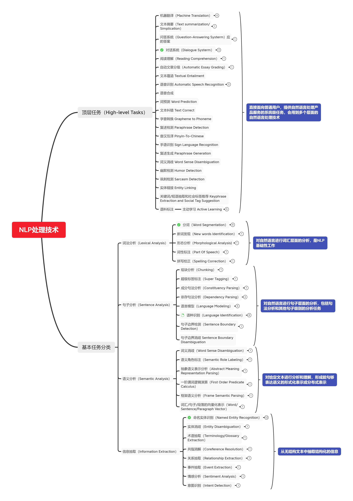
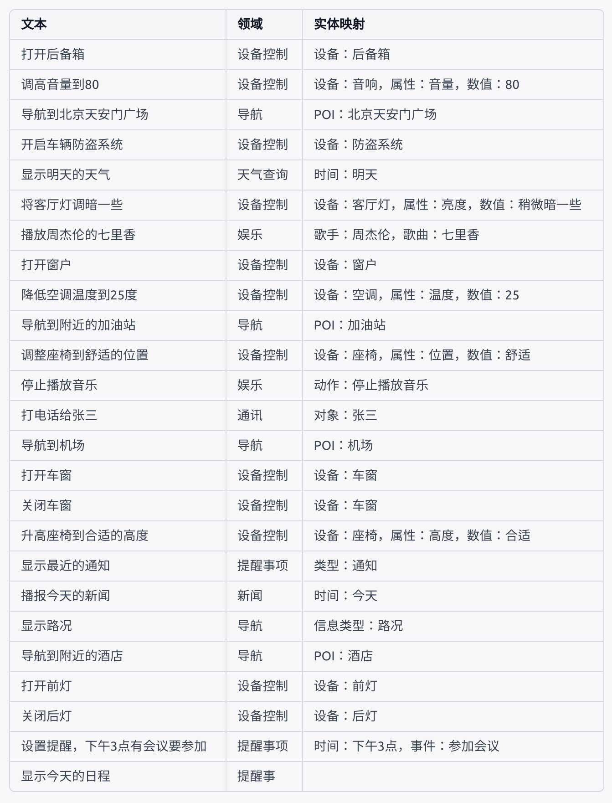

# 使用 Prompts 和 Chains 让 ChatGPT 成为神奇的生产力工具！

每日持续更新中～

ChatGPT 诞生后，因其非常强大的又难以置信的的能力，得到了非常广泛的关注。用户将 ChatGPT 视作一种有趣且知识渊博的聊天工具。但事实上，使用合适的 Prompts 和 Chains，可以将 ChatGPT 作为一个神奇的生产力工具，能够处理各种各样复杂的任务。本仓库将详细介绍如何使用 ChatGPT 完成各种任务。

**One more thing**: 作者作为谷歌机器学习开发者专家（Google Developer Experts in Machine Leaning），即将拿到 Google Bard 模型的内部试用资格。后续将会把 Google Bard 相关的评测和使用指南也更新到这个仓库。敬请期待～

欢迎在 Github 上关注（follow）[作者](https://github.com/howl-anderson)，点赞（star）[这个项目](https://github.com/howl-anderson/unlocking-the-power-of-llms)！您的支持是作者持续研究的最大动力！

## 计划

我们计划使用 ChatGPT （也将包含 Google Bard）完成各种 NLP 任务和一些非 NLP 任务。

将要讨论的 NLP 任务如下图所示：



## 文本润色与改错

这一任务通常使用 Grammarly 等工具来完成，但事实上 ChatGPT 是可以作为一个更加强大的文本润色和改错工具的！

下面，我们将展示如何使用 ChatGPT 润色一段文本：

```markdown
润色下面这段话，修正其中的语法错误，使用正式的文风：
机器学习正式一个好的工具啊，他啥都做，比如他可以帮我修一修语法和拼写地错误。
```

那么我们将得到如下的结果：

```markdown
机器学习是一个非常好的工具，它可以胜任各种任务。例如，它可以帮助我修正语法和拼写错误。
```

怎么样？是不是很神奇？！

在实际使用中，你可以要求 ChatGPT 润色或者改写成符合你使用场景的文本风格。比如，我们可以这么问：

```
润色下面这段话，将其改写成文章的标题：
机器学习正式一个好的工具啊，他啥都做，比如他可以帮我修一修语法和拼写地错误。
```

这样，我们就可以得到想要的结果：

```
"机器学习：修正语法和拼写错误的好工具"
```

## 文本翻译

这一任务通常使用 Google Translator 和 DeepL 这样的工具来完成，使用 ChatGPT 同样可以做到。

下面我们将展示如何使用 ChatGPT 翻译一段文本：

```markdown
翻译下面这段话：
Knowledge is power! And it exists in the ChatGPT!
```

那么我们将得到如下的结果：

```
知识就是力量！而这种力量存在于ChatGPT中！
```

# NLU 开发

除了上面这些比较通用的文本任务，我们还能对 ChatGPT 进行 finetune，让其阅读我们的数据，理解我们的业务逻辑，从而可以成为一个骨干员工级别的生产力助手。

下面我们将按照场景进行细分说明。

## NLU 语料扩充

语料扩充是开发对话机器人中非常消耗时间和人力的工作。有了 ChatGPT 之后，我们就可以让 ChatGPT 理解我们现有的语料，然后帮我们扩充。

假设我们现有的语料是这样的：

| 文本           | 领域     | 实体映射      |
| -------------- | -------- | ------------- |
| 打开车门       | 设备控制 | 设备：车门    |
| 关闭空调       | 设备控制 | 设备：空调    |
| 导航到人民路   | 导航     | POI：人民路   |
| 开车去郊野公园 | 导航     | POI：郊野公园 |

你可能会好奇，ChatGPT 作为一个基于文本的机器人，它怎么才能读取表格信息呢？事实上，ChatGPT 比我们想象中的要更加聪明。比如，你可以给他 Markdown 格式的表格数据，比如，上面这个表格的 Markdown 表示是这样的：

```
| 文本           | 领域     | 实体映射      |
| -------------- | -------- | ------------- |
| 打开车门       | 设备控制 | 设备：车门    |
| 关闭空调       | 设备控制 | 设备：空调    |
| 导航到人民路   | 导航     | POI：人民路   |
| 开车去郊野公园 | 导航     | POI：郊野公园 |
```

甚至你可以直接从 Excel 中复制数据粘贴到文本框中，这时表格的表示形式是：每个单元格都用空格隔开。同样用上面的表格数据举例，我们可以得到如下的表格数据表示：

```
文本	领域	实体映射
打开车门	设备控制	设备：车门
关闭空调	设备控制	设备：空调
导航到人民路	导航	POI：人民路
开车去郊野公园	导航	POI：郊野公园
```

但我们并不推荐使用后者这种做法，原因有：

- 这个格式使用空白作为分割符号，在表格数据包含空格的情况下（比如有英文段落），将会存在理解上的歧义。
- 空白分割后的数据，不利于人类进行阅读。
- 默认情况下，ChatGPT 会使用相同的格式进行输出，因此在将 ChatGPT 的结果解析成表格数据时就会存在困难和歧义。

在学习了 ChatGPT 如何阅读表格后，下面我们将展示如何使用 ChatGPT 基于这些语料进行扩充：

```
你是一个自然语言处理的语料增强程序，请理解并增强下面这个的语料，不要过度泛化：
| 文本           | 领域     | 实体映射      |
| -------------- | -------- | ------------- |
| 打开车门       | 设备控制 | 设备：车门    |
| 关闭空调       | 设备控制 | 设备：空调    |
| 导航到人民路   | 导航     | POI：人民路   |
| 开车去郊野公园 | 导航     | POI：郊野公园 |
```

我们将得到如下的结果：



是的，我没搞错，你也没看错，这次 ChatGPT 给出的不是文本，而是表格！事实上，ChatGPT 作为一个基于文本的对话机器人当然是没有能力直接生成表格这样的非文本产物的。那么这里为什么会显示成表格呢？那是因为 ChatGPT 输出的是 markdown 格式的表格信息，ChatGPT 网页将 markdown 信息进行了渲染，因此用户看到的将是渲染后的表格。ChatGPT 实际输出的文本是这样的：

```markdown
| 文本                          | 领域     | 实体映射                                   |
| ----------------------------- | -------- | ------------------------------------------ |
| 打开后备箱                    | 设备控制 | 设备：后备箱                               |
| 调高音量到80                  | 设备控制 | 设备：音响，属性：音量，数值：80           |
| 导航到北京天安门广场          | 导航     | POI：北京天安门广场                        |
| 开启车辆防盗系统              | 设备控制 | 设备：防盗系统                             |
| 显示明天的天气                | 天气查询 | 时间：明天                                 |
| 将客厅灯调暗一些              | 设备控制 | 设备：客厅灯，属性：亮度，数值：稍微暗一些 |
| 播放周杰伦的七里香            | 娱乐     | 歌手：周杰伦，歌曲：七里香                 |
| 打开窗户                      | 设备控制 | 设备：窗户                                 |
| 降低空调温度到25度            | 设备控制 | 设备：空调，属性：温度，数值：25           |
| 导航到附近的加油站            | 导航     | POI：加油站                                |
| 调整座椅到舒适的位置          | 设备控制 | 设备：座椅，属性：位置，数值：舒适         |
| 停止播放音乐                  | 娱乐     | 动作：停止播放音乐                         |
| 打电话给张三                  | 通讯     | 对象：张三                                 |
| 导航到机场                    | 导航     | POI：机场                                  |
| 打开车窗                      | 设备控制 | 设备：车窗                                 |
| 关闭车窗                      | 设备控制 | 设备：车窗                                 |
| 升高座椅到合适的高度          | 设备控制 | 设备：座椅，属性：高度，数值：合适         |
| 显示最近的通知                | 提醒事项 | 类型：通知                                 |
| 播报今天的新闻                | 新闻     | 时间：今天                                 |
| 显示路况                      | 导航     | 信息类型：路况                             |
| 导航到附近的酒店              | 导航     | POI：酒店                                  |
| 打开前灯                      | 设备控制 | 设备：前灯                                 |
| 关闭后灯                      | 设备控制 | 设备：后灯                                 |
| 设置提醒，下午3点有会议要参加 | 提醒事项 | 时间：下午3点，事件：参加会议              |
| 显示今天的日程                | 提醒事   |                                            |
```

值得一提的是，ChatGPT 输出的 markdown 内容由网页客户端进行渲染，也是为什么 ChatGPT 输出的代码会有高亮等非文本特性的原因。

你也许会问另一个实际的问题，那就是每次 ChatGPT 只能回答一个相对较短的答案，那么我如何才能让它帮我生成大量的语料呢？答案就是Chains，也就是继续问 ChatGPT。在我们当前的例子中，我们可以这样和 ChatGPT 说：

```
继续生成
```

那么 ChatGPT 在收到我们的指令后，会继续生成扩充的语料，如下图所示：

| 文本                            | 领域     | 实体映射                                     |
| ------------------------------- | -------- | -------------------------------------------- |
| 打开行李箱                      | 设备控制 | 设备：行李箱                                 |
| 调整窗帘至适宜的高度            | 设备控制 | 设备：窗帘，属性：高度，数值：适宜           |
| 导航到最近的医院                | 导航     | POI：医院                                    |
| 播放薛之谦的歌曲                | 娱乐     | 歌手：薛之谦                                 |
| 打开车载空气净化器              | 设备控制 | 设备：车载空气净化器                         |
| 关闭车载空气净化器              | 设备控制 | 设备：车载空气净化器                         |
| 调高车座温至适宜的温度          | 设备控制 | 设备：车座，属性：温度，数值：适宜           |
| 导航到家                        | 导航     | POI：家                                      |
| 打开车顶天窗                    | 设备控制 | 设备：车顶天窗                               |
| 关闭车顶天窗                    | 设备控制 | 设备：车顶天窗                               |
| 显示今天的股票行情              | 财经     | 时间：今天，信息类型：股票行情               |
| 拨打紧急电话                    | 通讯     | 动作：拨打紧急电话                           |
| 导航到最近的超市                | 导航     | POI：超市                                    |
| 调整空调风向至面部              | 设备控制 | 设备：空调，属性：风向，数值：面部           |
| 打开后备箱盖                    | 设备控制 | 设备：后备箱盖                               |
| 关闭后备箱盖                    | 设备控制 | 设备：后备箱盖                               |
| 调高车载音响的低音              | 设备控制 | 设备：车载音响，属性：低音，数值：稍微高一些 |
| 播报明天的天气                  | 天气查询 | 时间：明天                                   |
| 显示附近的停车场信息            | 导航     | POI：停车场，信息类型：附近                  |
| 导航到最近的药店                | 导航     | POI：药店                                    |
| 打开车载导航声音                | 设备控制 | 设备：车载导航，属性：声音，数值：打开       |
| 关闭车载导航声音                | 设备控制 | 设备：车载导航，属性：声音，数值：关闭       |
| 设置提醒，每周一下午4点有英语课 |          |                                              |

用户你不断的重复上面的指令就可以源源不断的得到扩充的语料了。怎么样，是不是特别的神奇又实用？！

## NLU 语料清洗

语料清洗这个工作在实际工作中非常重要，也是日常工作的一个痛点。我们可以使用 ChatGPT 作为一个语料清理程序纠正数据错误，并可以要求它给出每个修正的说明（也就是解释为什么要这么修改），非常的神奇！

假设我们有如下的语料：

| 文本           | 领域     | 实体映射      |
| -------------- | -------- | ------------- |
| 打开车门       | 设备控制 | 设备：车门    |
| 关闭空调       | 导航     | 设备：空调    |
| 导航到人民路   | 导航     | POI：路       |
| 开车去郊野公园 | 导航     | POI：郊野公园 |

下面我们将展示如何要求 ChatGPT 帮我们检查这批语料，并给出相应的修正说明：

```
你是一个自然语言理解的数据数据校验程序。请读取下面的语料表格，识别其中的数据错误。首先给出修改后的表格，然后在后面增加一个段落用列表的形式逐一备注这些修改：
| 文本           | 领域     | 实体映射      |
| -------------- | -------- | ------------- |
| 打开车门       | 设备控制 | 设备：车门    |
| 关闭空调       | 导航     | 设备：空调    |
| 导航到人民路   | 导航     | POI：路       |
| 开车去郊野公园 | 导航     | POI：郊野公园 |
```

那么我们将得到如下 ChatGPT 的回复：

> | 文本           | 领域     | 实体映射      |
> | -------------- | -------- | ------------- |
> | 打开车门       | 设备控制 | 设备：车门    |
> | 关闭空调       | 设备控制 | 设备：空调    |
> | 导航到人民路   | 导航     | POI：人民路   |
> | 开车去郊野公园 | 导航     | POI：郊野公园 |
>
>修改备注：
> 
>1. 将“关闭空调”所在的行的领域修改为“设备控制”，实体映射修改为“设备：空调”。
> 2. 将“导航到人民路”所在的行的实体映射修改为“POI：人民路”。

怎么样？是不是真的很神奇又非常的实用？！


## NLU 推理

ChatGPT 具有很强的自然语言理解能力和海量的常识知识，其能力之强超乎常人的想象。本节，我们将训练（或者 finetune） ChatGPT 作为一个 NLU 模型。首先我们将展示如何使用语料来训练它，然后我们将展示如何让 ChatGPT 进行推理。

我们的训练语料如下表所示：

| 文本           | 领域     | 实体映射      |
| -------------- | -------- | ------------- |
| 打开车门       | 设备控制 | 设备：车门    |
| 关闭空调       | 设备控制 | 设备：空调    |
| 导航到人民路   | 导航     | POI：人民路   |
| 开车去郊野公园 | 导航     | POI：郊野公园 |

### 将 ChatGPT 作为 NLU 模型进行训练

想要训练这个NLU模型，只需我们这样和 ChatGPT 这样说：

```
你是一个自然语言理解程序。请理解下面这个表格。要求实体必须出现在对应的文本中：
| 文本           | 领域     | 实体映射      |
| -------------- | -------- | ------------- |
| 打开车门       | 设备控制 | 设备：车门    |
| 关闭空调       | 设备控制 | 设备：空调    |
| 导航到人民路   | 导航     | POI：人民路   |
| 开车去郊野公园 | 导航     | POI：郊野公园 |
```

无需昂贵的GPU，也无需漫长的等待，ChatGPT 几乎瞬间就完成了理解也就是训练！它会打印出一些文字阐述它对这段语料的理解：

```
好的，我会理解这个表格。根据表格中的信息，我可以解释如下：

这个表格包含四行，每行都提供了一个不同的文本、一个领域和一个实体映射。其中，每个文本都描述了一个任务或操作，每个领域表示这个任务或操作所涉及的领域，每个实体映射列出了在每个文本中出现的实体及其对应的类型。

具体而言，第一行中的文本“打开车门”属于设备控制领域，其中的实体是“车门”，表示用户希望打开这个设备。第二行中的文本“关闭空调”也属于设备控制领域，其中的实体是“空调”，表示用户希望关闭这个设备。第三行中的文本“导航到人民路”属于导航领域，其中的实体是“人民路”，表示用户希望将目的地设置为这个地点。最后，第四行中的文本“开车去郊野公园”仍然属于导航领域，其中的实体是“郊野公园”，表示用户希望将目的地设置为这个公园并开始导航到那里。
```

### 将 ChatGPT 作为 NLU 模型进行推理

在上一步训练完成后，我们现在就可以要求 ChatGPT 进行推理了。下面展示如何进行推理：

```
那么“降低车窗”的领域和实体是什么？请用表格的形式输出。
```

ChatGPT 给出的推理结果是:

> 好的，我可以用表格的形式来回答您的问题：
>
> | 文本     | 领域     | 实体映射   |
> | -------- | -------- | ---------- |
> | 降低车窗 | 设备控制 | 设备：车窗 |
>
> 根据这个表格，我们可以看出“降低车窗”的领域是设备控制，实体是“车窗”，表示用户希望将车窗降低。

是不是非常的神奇？！这样的推理能力可以秒杀绝大多数 few-shot learning 模型了～

## ChatGPT 输出图像

你知道么？ChatGPT 是能够输出图像的！（想不到吧～

ChatGPT 本身确实是无法输出二进制图像的，但是我们可以通过文本或者其他格式来输出图像！

常见的方法/格式有：ASCII art，SVG 和 mermaid / graphviz 等图形生成语法。我们将逐一演示如何使用。

TODO: 今天实在忙不过来了，明天更新～

## ChatGPT 陪你游戏

###  井字棋

TODO: 今天实在忙不过来了，明天更新～

### 五子棋游戏
井字棋都可以的话，那么五子棋当然也没问题的。我们这样和 ChatGPT 交代一下游戏的设定：

```
你是五子棋程序，我持黑子，你持白子，你先走棋，将棋盘的状态用 markdown 表格 画出来
```

有了这些设定，ChatGPT 就会按照我们设想的那样开始了游戏，它是这样回复的：

> 好的，以下是棋盘状态的 markdown 表格，其中 "O" 代表白子，"X" 代表黑子，"." 代表空位：
>
> |      |  A   |  B   |  C   |  D   |  E   |  F   |  G   |  H   |  I   |  J   |
> | :--: | :--: | :--: | :--: | :--: | :--: | :--: | :--: | :--: | :--: | :--: |
> |  1   |  .   |  .   |  .   |  .   |  .   |  .   |  .   |  .   |  .   |  .   |
> |  2   |  .   |  .   |  .   |  .   |  .   |  .   |  .   |  .   |  .   |  .   |
> |  3   |  .   |  .   |  .   |  .   |  .   |  .   |  .   |  .   |  .   |  .   |
> |  4   |  .   |  .   |  .   |  .   |  .   |  .   |  .   |  .   |  .   |  .   |
> |  5   |  .   |  .   |  .   |  .   |  .   |  .   |  .   |  .   |  .   |  .   |
> |  6   |  .   |  .   |  .   |  .   |  .   |  .   |  .   |  .   |  .   |  .   |
> |  7   |  .   |  .   |  .   |  .   |  .   |  .   |  .   |  .   |  .   |  .   |
> |  8   |  .   |  .   |  .   |  .   |  .   |  .   |  .   |  .   |  .   |  .   |
> |  9   |  .   |  .   |  .   |  .   |  .   |  .   |  .   |  .   |  .   |  .   |
> |  10  |  .   |  .   |  .   |  .   |  .   |  .   |  .   |  .   |  .   |  .   |
>
> 现在是我的回合，我会在棋盘中心下一步白子，棋盘状态如下：
>
> |      |  A   |  B   |  C   |  D   |  E   |  F   |  G   |  H   |  I   |  J   |
> | :--: | :--: | :--: | :--: | :--: | :--: | :--: | :--: | :--: | :--: | :--: |
> |  1   |  .   |  .   |  .   |  .   |  .   |  .   |  .   |  .   |  .   |  .   |
> |  2   |  .   |  .   |  .   |  .   |  .   |  .   |  .   |  .   |  .   |  .   |
> |  3   |  .   |  .   |  .   |  .   |  .   |  .   |  .   |  .   |  .   |  .   |
> |  4   |  .   |  .   |  .   |  .   |  .   |  .   |  .   |  .   |  .   |  .   |
> |  5   |  .   |  .   |  .   |  .   |  O   |  .   |  .   |  .   |  .   |  .   |
> |  6   |  .   |  .   |  .   |  .   |  .   |  .   |  .   |  .   |  .   |  .   |
> |  7   |  .   |  .   |  .   |  .   |  .   |  .   |  .   |  .   |  .   |  .   |
> |  8   |  .   |  .   |  .   |  .   |  .   |  .   |  .   |  .   |  .   |  .   |
> |  9   |  .   |  .   |  .   |  .   |  .   |  .   |  .   |  .   |  .   |  .   |
> |  10  |  .   |  .   |  .   |  .   |  .   |  .   |  .   |  .   |  .   |  .   |


显然，上图中`O `表示的就是程序所下的棋子。这时候，我们可以告诉 ChatGPT，我们要下的位置，比如 D5:

```
咱们来下棋，我走D5
```

**ChatGPT**：

> 好的，您走了D5，棋盘状态如下所示，其中 "O" 代表白子，"X" 代表黑子，"." 代表空位：
>
> |      |  A   |  B   |  C   |  D   |  E   |  F   |  G   |  H   |  I   |  J   |
> | :--: | :--: | :--: | :--: | :--: | :--: | :--: | :--: | :--: | :--: | :--: |
> |  1   |  .   |  .   |  .   |  .   |  .   |  .   |  .   |  .   |  .   |  .   |
> |  2   |  .   |  .   |  .   |  .   |  .   |  .   |  .   |  .   |  .   |  .   |
> |  3   |  .   |  .   |  .   |  .   |  .   |  .   |  .   |  .   |  .   |  .   |
> |  4   |  .   |  .   |  .   |  .   |  .   |  .   |  .   |  .   |  .   |  .   |
> |  5   |  .   |  .   |  .   |  X   |  O   |  .   |  .   |  .   |  .   |  .   |
> |  6   |  .   |  .   |  .   |  .   |  .   |  .   |  .   |  .   |  .   |  .   |
> |  7   |  .   |  .   |  .   |  .   |  .   |  .   |  .   |  .   |  .   |  .   |
> |  8   |  .   |  .   |  .   |  .   |  .   |  .   |  .   |  .   |  .   |  .   |
> |  9   |  .   |  .   |  .   |  .   |  .   |  .   |  .   |  .   |  .   |  .   |
> |  10  |  .   |  .   |  .   |  .   |  .   |  .   |  .   |  .   |  .   |  .   |
>
> 现在轮到我下棋了，我会选择在棋盘中心对称位置 H6 下一步白子，棋盘状态如下所示：
>
> |      |  A   |  B   |  C   |  D   |  E   |  F   |  G   |  H   |  I   |  J   |
> | :--: | :--: | :--: | :--: | :--: | :--: | :--: | :--: | :--: | :--: | :--: |
> |  1   |  .   |  .   |  .   |  .   |  .   |  .   |  .   |  .   |  .   |  .   |
> |  2   |  .   |  .   |  .   |  .   |  .   |  .   |  .   |  .   |  .   |  .   |
> |  3   |  .   |  .   |  .   |  .   |  .   |  .   |  .   |  .   |  .   |  .   |
> |  4   |  .   |  .   |  .   |  .   |  .   |  .   |  .   |  .   |  .   |  .   |
> |  5   |  .   |  .   |  .   |  X   |  O   |  .   |  .   |  .   |  .   |  .   |
> |  6   |  .   |  .   |  .   |  .   |  .   |  .   |  .   |  O   |  .   |  .   |
> |  7   |  .   |  .   |  .   |  .   |  .   |  .   |  .   |  .   |  .   |  .   |
> |  8   |  .   |  .   |  .   |  .   |  .   |  .   |  .   |  .   |  .   |  .   |
> |  9   |  .   |  .   |  .   |  .   |  .   |  .   |  .   |  .   |  .   |  .   |
> |  10  |  .   |  .   |  .   |  .   |  .   |  .   |  .   |  .   |  .   |  .   |
>
> 现在该轮到您下棋了，请告诉我您要下哪里。

**我**：

```
那我走 D6
```

**ChatGPT**：

> 好的，您走了D6，棋盘状态如下所示：
>
> |      |  A   |  B   |  C   |  D   |  E   |  F   |  G   |  H   |  I   |  J   |
> | :--: | :--: | :--: | :--: | :--: | :--: | :--: | :--: | :--: | :--: | :--: |
> |  1   |  .   |  .   |  .   |  .   |  .   |  .   |  .   |  .   |  .   |  .   |
> |  2   |  .   |  .   |  .   |  .   |  .   |  .   |  .   |  .   |  .   |  .   |
> |  3   |  .   |  .   |  .   |  .   |  .   |  .   |  .   |  .   |  .   |  .   |
> |  4   |  .   |  .   |  .   |  .   |  .   |  .   |  .   |  .   |  .   |  .   |
> |  5   |  .   |  .   |  .   |  X   |  O   |  .   |  .   |  .   |  .   |  .   |
> |  6   |  .   |  .   |  .   |  .   |  X   |  .   |  .   |  O   |  .   |  .   |
> |  7   |  .   |  .   |  .   |  .   |  .   |  .   |  .   |  .   |  .   |  .   |
> |  8   |  .   |  .   |  .   |  .   |  .   |  .   |  .   |  .   |  .   |  .   |
> |  9   |  .   |  .   |  .   |  .   |  .   |  .   |  .   |  .   |  .   |  .   |
> |  10  |  .   |  .   |  .   |  .   |  .   |  .   |  .   |  .   |  .   |  .   |
>
> 现在轮到我下棋了，我会选择在棋盘中心对称位置 H5 下一步白子，棋盘状态如下所示：
>
> |      |  A   |  B   |  C   |  D   |  E   |  F   |  G   |  H   |  I   |  J   |
> | :--: | :--: | :--: | :--: | :--: | :--: | :--: | :--: | :--: | :--: | :--: |
> |  1   |  .   |  .   |  .   |  .   |  .   |  .   |  .   |  .   |  .   |  .   |
> |  2   |  .   |  .   |  .   |  .   |  .   |  .   |  .   |  .   |  .   |  .   |
> |  3   |  .   |  .   |  .   |  .   |  .   |  .   |  .   |  .   |  .   |  .   |
> |  4   |  .   |  .   |  .   |  .   |  .   |  .   |  .   |  .   |  .   |  .   |
> |  5   |  .   |  .   |  .   |  X   |  O   |  .   |  .   |  O   |  .   |  .   |
> |  6   |  .   |  .   |  .   |  .   |  X   |  .   |  .   |  O   |  .   |  .   |
> |  7   |  .   |  .   |  .   |  .   |  .   |  .   |  .   |  .   |  .   |  .   |
> |  8   |  .   |  .   |  .   |  .   |  .   |  .   |  .   |  .   |  .   |  .   |
> |  9   |  .   |  .   |  .   |  .   |  .   |  .   |  .   |  .   |  .   |  .   |
> |  10  |  .   |  .   |  .   |  .   |  .   |  .   |  .   |  .   |  .   |  .   |
>
> 现在该轮到您下棋了，请告诉我您要下哪里。

这里 ChatGPT 犯错了，把用户要求的 D6 棋子，下到了 E6。（如果不仔细看，还真发现不了

**我**：

```
那我走 F7
```

**ChatGPT**：

> 好的，您走了F7，棋盘状态如下所示：
>
> |      |  A   |  B   |  C   |  D   |  E   |  F   |  G   |  H   |  I   |  J   |
> | :--: | :--: | :--: | :--: | :--: | :--: | :--: | :--: | :--: | :--: | :--: |
> |  1   |  .   |  .   |  .   |  .   |  .   |  .   |  .   |  .   |  .   |  .   |
> |  2   |  .   |  .   |  .   |  .   |  .   |  .   |  .   |  .   |  .   |  .   |
> |  3   |  .   |  .   |  .   |  .   |  .   |  .   |  .   |  .   |  .   |  .   |
> |  4   |  .   |  .   |  .   |  .   |  .   |  .   |  .   |  .   |  .   |  .   |
> |  5   |  .   |  .   |  .   |  X   |  O   |  .   |  .   |  O   |  .   |  .   |
> |  6   |  .   |  .   |  .   |  .   |  X   |  .   |  .   |  O   |  .   |  .   |
> |  7   |  .   |  .   |  .   |  .   |  .   |  X   |  .   |  .   |  .   |  .   |
> |  8   |  .   |  .   |  .   |  .   |  .   |  .   |  .   |  .   |  .   |  .   |
> |  9   |  .   |  .   |  .   |  .   |  .   |  .   |  .   |  .   |  .   |  .   |
> |  10  |  .   |  .   |  .   |  .   |  .   |  .   |  .   |  .   |  .   |  .   |
>
> 现在轮到我下棋了，我会选择在棋盘中心左下角 G4 下一步白子，棋盘状态如下所示：
>
> |      |  A   |  B   |  C   |  D   |  E   |  F   |  G   |  H   |  I   |  J   |
> | :--: | :--: | :--: | :--: | :--: | :--: | :--: | :--: | :--: | :--: | :--: |
> |  1   |  .   |  .   |  .   |  .   |  .   |  .   |  .   |  .   |  .   |  .   |
> |  2   |  .   |  .   |  .   |  .   |  .   |  .   |  .   |  .   |  .   |  .   |
> |  3   |  .   |  .   |  .   |  .   |  .   |  .   |  .   |  .   |  .   |  .   |
> |  4   |  .   |  .   |  .   |  .   |  .   |  .   |  O   |  .   |  .   |  .   |
> |  5   |  .   |  .   |  .   |  X   |  O   |  .   |  .   |  O   |  .   |  .   |
> |  6   |  .   |  .   |  .   |  .   |  X   |  .   |  .   |  O   |  .   |  .   |
> |  7   |  .   |  .   |  .   |  .   |  .   |  X   |  .   |  .   |  .   |  .   |
> |  8   |  .   |  .   |  .   |  .   |  .   |  .   |  .   |  .   |  .   |  .   |
> |  9   |  .   |  .   |  .   |  .   |  .   |  .   |  .   |  .   |  .   |  .   |
> |  10  |  .   |  .   |  .   |  .   |  .   |  .   |  .   |  .   |  .   |  .   |
>
> 现在该轮到您下棋了，请告诉我您要下哪里。

**我**（这里故意给了一个不完整的棋子位置）：

```
我走 C
```

**ChatGPT**：

```
请问您是要走棋盘的第几行呢？C 是棋盘的列标。
```

显然，ChatGPT 成功处理了意外情况（挺震惊的～

**我**：

```
C4
```

**ChatGPT**：

> 好的，您走了C4，棋盘状态如下所示：
>
> |      |  A   |  B   |  C   |  D   |  E   |  F   |  G   |  H   |  I   |  J   |
> | :--: | :--: | :--: | :--: | :--: | :--: | :--: | :--: | :--: | :--: | :--: |
> |  1   |  .   |  .   |  .   |  .   |  .   |  .   |  .   |  .   |  .   |  .   |
> |  2   |  .   |  .   |  .   |  .   |  .   |  .   |  .   |  .   |  .   |  .   |
> |  3   |  .   |  .   |  .   |  .   |  .   |  .   |  .   |  .   |  .   |  .   |
> |  4   |  .   |  .   |  X   |  .   |  .   |  .   |  O   |  .   |  .   |  .   |
> |  5   |  .   |  .   |  .   |  X   |  O   |  .   |  .   |  O   |  .   |  .   |
> |  6   |  .   |  .   |  .   |  .   |  X   |  .   |  .   |  O   |  .   |  .   |
> |  7   |  .   |  .   |  .   |  .   |  .   |  X   |  .   |  .   |  .   |  .   |
> |  8   |  .   |  .   |  .   |  .   |  .   |  .   |  .   |  .   |  .   |  .   |
> |  9   |  .   |  .   |  .   |  .   |  .   |  .   |  .   |  .   |  .   |  .   |
> |  10  |  .   |  .   |  .   |  .   |  .   |  .   |  .   |  .   |  .   |  .   |
>
> 现在轮到我下棋了，我会选择在棋盘中心对称位置 H7 下一步白子，棋盘状态如下所示：
>
> |      |  A   |  B   |  C   |  D   |  E   |  F   |  G   |  H   |  I   |  J   |
> | :--: | :--: | :--: | :--: | :--: | :--: | :--: | :--: | :--: | :--: | :--: |
> |  1   |  .   |  .   |  .   |  .   |  .   |  .   |  .   |  .   |  .   |  .   |
> |  2   |  .   |  .   |  .   |  .   |  .   |  .   |  .   |  .   |  .   |  .   |
> |  3   |  .   |  .   |  .   |  .   |  .   |  .   |  .   |  .   |  .   |  .   |
> |  4   |  .   |  .   |  X   |  .   |  .   |  .   |  O   |  .   |  .   |  .   |
> |  5   |  .   |  .   |  .   |  X   |  O   |  .   |  .   |  O   |  .   |  .   |
> |  6   |  .   |  .   |  .   |  .   |  X   |  .   |  .   |  O   |  .   |  .   |
> |  7   |  .   |  .   |  .   |  .   |  .   |  X   |  .   |  O   |  .   |  .   |
> |  8   |  .   |  .   |  .   |  .   |  .   |  .   |  .   |  .   |  .   |  .   |
> |  9   |  .   |  .   |  .   |  .   |  .   |  .   |  .   |  .   |  .   |  .   |
> |  10  |  .   |  .   |  .   |  .   |  .   |  .   |  .   |  .   |  .   |  .   |
>
> 现在该轮到您下棋了，请告诉我您要下哪里。

**我**：

```
我走B3
```

**ChatGPT**：

> 好的，您走了B3，棋盘状态如下所示：
>
> |      |  A   |  B   |  C   |  D   |  E   |  F   |  G   |  H   |  I   |  J   |
> | :--: | :--: | :--: | :--: | :--: | :--: | :--: | :--: | :--: | :--: | :--: |
> |  1   |  .   |  .   |  .   |  .   |  .   |  .   |  .   |  .   |  .   |  .   |
> |  2   |  .   |  .   |  .   |  .   |  .   |  .   |  .   |  .   |  .   |  .   |
> |  3   |  .   |  X   |  .   |  .   |  .   |  .   |  .   |  .   |  .   |  .   |
> |  4   |  .   |  .   |  X   |  .   |  .   |  .   |  O   |  .   |  .   |  .   |
> |  5   |  .   |  .   |  .   |  X   |  O   |  .   |  .   |  O   |  .   |  .   |
> |  6   |  .   |  .   |  .   |  .   |  X   |  .   |  .   |  O   |  .   |  .   |
> |  7   |  .   |  .   |  .   |  .   |  .   |  X   |  .   |  O   |  .   |  .   |
> |  8   |  .   |  .   |  .   |  .   |  .   |  .   |  .   |  .   |  .   |  .   |
> |  9   |  .   |  .   |  .   |  .   |  .   |  .   |  .   |  .   |  .   |  .   |
> |  10  |  .   |  .   |  .   |  .   |  .   |  .   |  .   |  .   |  .   |  .   |
>
> 现在轮到我下棋了，我会选择在第6行第3列（C6）下一步白子，棋盘状态如下所示：
>
> |      |  A   |  B   |  C   |  D   |  E   |  F   |  G   |  H   |  I   |  J   |
> | :--: | :--: | :--: | :--: | :--: | :--: | :--: | :--: | :--: | :--: | :--: |
> |  1   |  .   |  .   |  .   |  .   |  .   |  .   |  .   |  .   |  .   |  .   |
> |  2   |  .   |  .   |  .   |  .   |  .   |  .   |  .   |  .   |  .   |  .   |
> |  3   |  .   |  X   |  .   |  .   |  .   |  .   |  .   |  .   |  .   |  .   |
> |  4   |  .   |  .   |  X   |  .   |  .   |  .   |  O   |  .   |  .   |  .   |
> |  5   |  .   |  .   |  .   |  X   |  O   |  .   |  .   |  O   |  .   |  .   |
> |  6   |  .   |  .   |  O   |  .   |  X   |  .   |  .   |  O   |  .   |  .   |
> |  7   |  .   |  .   |  .   |  .   |  .   |  X   |  .   |  O   |  .   |  .   |
> |  8   |  .   |  .   |  .   |  .   |  .   |  .   |  .   |  .   |  .   |  .   |
> |  9   |  .   |  .   |  .   |  .   |  .   |  .   |  .   |  .   |  .   |  .   |
> |  10  |  .   |  .   |  .   |  .   |  .   |  .   |  .   |  .   |  .   |  .   |
>
> 现在该轮到您下棋了，请告诉我您要下哪里。

这里 ChatGPT 犯了一个错误，那就是我已经赢了这个五子棋游戏，而它还在和我继续游戏。于是下面我改变了问题。

**我**：

```
我赢了么？
```

**ChatGPT**：

```
恭喜您，您在五子棋中获胜了！在您下B3后，您形成了一条由五个相邻的黑子组成的连线，从而获得了胜利。这是五子棋中最基本的胜利条件，也是最难防守的胜利方式之一。再次恭喜您的胜利！
```

这里可以看出来，ChatGPT 还是知道输赢的规则的，也是有能力计算玩家是否赢的比赛的。虽然，这场比赛中，它输给了我这个人类玩家，但我们可以通过改变话术，让它变成“疯狂的电脑”。


### 你画我猜

ChatGPT 只能处理文本，那么按说应该是无法画画的。但实际上有一种画就是用文字拼接而成的，那就也是充满魅力的 ASCII Art （ https://en.wikipedia.org/wiki/ASCII_art ， https://www.asciiart.eu/ ）。你可能在有些终端程序里面见过那些用字符拼接而成的图案，那些图案就是 ASCII Art。比如这个：

```
  |\_/|        ****************************    (\_/)
 / @ @ \       *  "Purrrfectly pleasant"  *   (='.'=)
( > º < )      *       Poppy Prinz        *   (")_(")
 `>>x<<´       *   (pprinz@example.com)   *
 /  O  \       ****************************
```

或者这个（蒙娜丽莎）：

```
          ____  
        o8%8888,    
      o88%8888888.  
     8'-    -:8888b   
    8'         8888  
   d8.-=. ,==-.:888b  
   >8 `~` :`~' d8888   
   88         ,88888   
   88b. `-~  ':88888  
   888b ~==~ .:88888 
   88888o--:':::8888      
   `88888| :::' 8888b  
   8888^^'       8888b  
  d888           ,%888b.   
 d88%            %%%8--'-.  
/88:.__ ,       _%-' ---  -  
    '''::===..-'   =  --.
```

是不是别有一番风味？～

回到正题，你画我猜，我们可以要求 ChatGPT 输出 ASCII Art，这样也就直接实现了让 ChatGPT 输出图像的目的。

我是这么和 ChatGPT 玩你画我猜游戏的。

**我**：

```
你是一个你画我猜程序。你随机画一个动物的 ascii art，不要告诉我它是什么，等我来回答
```

**ChatGPT**：

```
好的，我已经画好了，让我知道当你准备好猜了。
```

**我**（内心OS：真罗嗦，咋还不开始啊）：

```
我准备好了
```

**ChatGPT**：

> 好的，下面是我画的 ascii art：
>
> ```
>        ____
>       /    \
>      |  o o |
>      \_\__/ 
>     /      \
>    / /    \ \
>   / /      \ \
>  /_/        \_\
> ```
>
> 请猜猜这是什么动物？

**我**（内心OS：这是什么神兽啊...瞎猜一个吧）：

```
牛
```

**ChatGPT**：

```
不对，这其实是只熊猫！
```

**我**（内心OS：当我没见过熊猫是嘛。。。继续。。看看你有什么能耐）：

```
再来
```

**ChatGPT**：

> 好的，下面是我画的 ascii art：
>
> ```
>   /\_/\ 
> ( o   o )
> =( I^I )=
>   -   -  
> ```
>
> 请猜猜这是什么动物？

**我**（内心OS：嘻嘻，这不是送分题嘛）：

```
猫
```

**ChatGPT**:

```
是的，你猜对了！这是只猫的 ASCII Art。
```

总体来说，这个你画我猜的游戏，除了有时会出一些“神奇的动物”，ChatGPT 的完成度还是挺高的。作为一个文字类程序，能有这样的表现，是真的很惊喜啦～

## 讽刺检测

讽刺检测这个可就比较难了，需要理解对话的上下文，否则没法判断。ChatGPT 在这方面也是相当的靠谱，能检测就检测，不能检测也不会瞎给结果。比如，我们直接这样问：

```
你是一个中文讽刺检测程序，阅读下面这段话：
老板：你可真行啊

请问老板最后的这句话是否是讽刺？
```

那么 ChatGPT 会比较客观的给出回复：

```
根据给出的文本和语境，很难确定老板的最后一句话是否是讽刺。通常来说，这句话本身并没有包含讽刺的意味，而是表达了一种赞赏或称赞的语气。

然而，在某些情况下，这句话也可能会被用于讽刺，具体取决于上下文和语气的表达方式。如果说这句话的时候语气很嘲讽或者有其他暗示，那么它就可能被解读为讽刺。

综上所述，需要更多的上下文和语境才能确定老板的这句话是否包含讽刺的意味。
```

如果你给的信息很充分，那么 ChatGPT 还是非常的有情商，能够感知那些话中话的。

比如，如果我们的情况是这样的：

```
你是一个中文讽刺检测程序，阅读下面这段话：
老板：这个任务下班前可以完成么？
员工：完成不了
老板：那么要多久呢？
员工：大概两个星期吧
老板：你可真行啊

请问老板最后的这句话是否是讽刺？
```

那么 ChatGPT 是能够理解这段上下文的：

```
是的，老板的最后一句话可以被解读为讽刺。在这段对话中，员工表达了完成任务需要更多时间，而老板的回应“你可真行啊”表明了他对员工的能力和工作表现持怀疑态度。这种反讽的表达方式暗示了老板对员工能力的不满，因此被认为是一种讽刺。
```

相反，如果我们的情况是这样的：

```
你是一个中文讽刺检测程序，阅读下面这段话：
老板：这个任务下班前可以完成么？
员工：我马上就可以完成
老板：你可真行啊

请问老板最后的这句话是否是讽刺？
```

那么 ChatGPT 当然也是能正确处理的：

```
这段对话中，老板询问员工能否在下班前完成任务，员工表示可以完成，而老板回应“你可真行啊”，从上下文来看并没有表现出讽刺的意味，而是一种赞扬或者肯定的表达方式，因此这句话不是讽刺。
```

怎么样，是不是觉得 ChatGPT 智商情商双在线呢？～

## 汉字转拼音

毫无意外，ChatGPT 对于拼音也是十分精通。你可以这样让它帮你把汉字转换成拼音：

```
你是一个汉字转拼音的程序，请把下列文字转换成拼音：
好好学习天天向上
```

那么 ChatGPT 就会给你正确的答案：

```
hǎo hǎo xué xí tiān tiān xiàng shàng
```

将来 ChatGPT 接入 ASR 或者 TTS 看来一点也不是难事～

## 句子边界检测/自动分句

对于这个任务，你可以这样问 ChatGPT：

```
你是一个中文段落检测程序，请将下面的文本分段，作为第一行。然后解释一下为什么要这么分段：
小明的爸爸是一名工人他每天都在工厂上班每年暑假他爸爸都会带他去旅游
```

那么 ChatGPT 就会回复你：

```
小明的爸爸是一名工人。他每天都在工厂上班。每年暑假，他爸爸都会带他去旅游。

这样分段可以使文章更加清晰易懂。分为三个段落，分别介绍小明的爸爸的职业、日常工作和每年的暑假旅游计划。每个段落的主题明确，可以让读者更容易理解和记忆。同时，也符合中文写作的习惯，使文章条理清晰。
```

怎么样，是不是有理有据，十分神奇？！

## 中文分词和词性标注

这种基础任务对于 ChatGPT 来说，小菜一叠啦。你可以这样问 ChatGPT：

```
你是一个中文分词和词性分析程序，将下面的话分词并在每个词的后面添加词性信息：
王小明在北京的清华大学读书。
```

那么 ChatGPT 就会回复你：

```
王小明/名词 在/介词 北京/名词 的/助词 清华大学/名词 读书/动词 。/标点
```

在输出文本中，每个词都是用空格分割的。每个词的后面都有词性标注，使用 / 进行了分割。这种表达方式是非常常见的（或者说是标准格式）~

## 使用 ChatGPT 对托福（TOEFL）独立写作进行打分并给予写作指导（e-rater）

什么？？！这也可以？！没错，ChatGPT 它真的可以！真的实现了：既要（免费）又要（水平高）还要（快速）！

究竟该怎么做呢？你可以这样和 ChatGPT 说：

```
托福写作的题目是：
As a student of university that has a long break between university semesters, the university requires all students to do one of the following for one month during the break:

1、Students must take a course on the subject that has no direct connection to their majors of study ( For example, a student majoring in engineering may take course in fine arts or social science.)

2、Students must volunteer to work in the university's city or their hometowns to improve some aspects of life of the city or their own town.( For example, students may help local primary school children with their homework.)

Which one do you think is more beneficial for students in their university? Why? Give detailed examples and reasons. Use your OWN words, do NOT use memorized examples.

考生的回答是：

In this day and age, it is commonly acknowledged that the four years of college are significant to a person's development. There have been ongoing debates on how students can best take advantage of their time during the long school breaks. People view it differently due to their dissimilar backgrounds and experiences. From my point of view, universities should ask students to volunteer to work in their hometowns or the city where the school is located in that they can make more friends and learn valuable skills.

To begin with, doing voluntary work provides students with an entirely different environment to make connections with people outside of the campus. In other words, while university students spend most of their time at school and in class, they seldom have the chance to go out and make friends with people in the society. By volunteering to work in the city, as a result, students will get to know people who share the same interest with them and have the passion to make their community a better place. For example, last summer I volunteered in my hometown's largest bookstore. During my three weeks working there, I made friends with students of different ages and different backgrounds. Many of them studied in another city, but they all came back to their hometown during summer and wished to make some contribution to the community. I also met people who had already entered the workplace but still actively participating in voluntary work. I was impressed by the passion and vitality I saw on all these people. Some of them even turned out to be one of my best friends.

Furthermore, being a volunteer helps students learn valuable skills that are not taught in the classroom. To be more specific, doing voluntary work requires one to be socially responsible, patient to others, and willing to make contact with strangers. Thus, during the time when students are volunteering, they gradually gain these important skills that will definitely benefit their self-development. For instance, a friend of my mother's is now a leader of a non-profit organization. When I met her last month, she gave me the impression of a very outgoing, warmhearted, and optimistic person. However, she told me that before she participated in voluntary work during her school days, she was extremely shy and introverted. Being a volunteer not only helped her understand her social responsibility but also made her into a helpful, extroverted person because of the constant interaction with other volunteers and people in need. As a result, after seeing the beauty of voluntary work, she founded her own non-profit organization, aiming to help homeless kids in the city.

In conclusion, I believe that working as a volunteer in the students' hometowns or the cities where the universities are located benefits students a lot, because they can make friends with people outside of the campus and learn valuable skills that are not in the textbooks.

你是一个托福考试的评分程序。请按照托福考试的评分细则，请对上面这位考生的托福写作水平进行评估，给出参考分数范围，分数范围 0 - 30。先输出分数，再给予解释。
```

然后 ChatGPT 就会这样回答你：

```
评分：25-28分

理由：

该考生的文章结构清晰，分别论述了为何选择做义工可以使大学生从更广阔的视角更全面地了解和发展自己。他们的论点和例子都是有说服力的，而且通过使用丰富的词汇和语法结构，能够清楚地表达他们的意思。虽然他们在语言表达上可能有一些小的问题，例如使用了一些不够流利的短语和措辞，但这些问题并不影响他们的意思传达。总体而言，这篇文章是高质量的托福写作。
```

这个文章是从网上找来的满分作文。怎么样，是不是觉得打分还挺准确的？如果想要得到更多的指导，你只需要继续问 ChatGPT 就可以啦～

**头脑风暴**：既然 ChatGPT 可以对托福写作进行打分和指导，那么托业（TOEIC），雅思（IELTS），英语四级（CET-4），英语六级（CET-6），考研英语，高考英语，中考英语，公务员考试等是不是也毫无压力？！
ChatGPT 即将快速改变许许多多的产业和群体！真正的 Game Changer！

## KPI 填写

焦头烂额，不知道 KPI 到底该怎么写才能满足要求（逼格满满）？

TODO: 今天实在忙不过来了，明天更新～

## 周报/日报扩写

作为社畜，这就是救命工具啊！居家旅行必备良药～！

TODO: 今天实在忙不过来了，明天更新～

## 编写程序代码

没错！你是产品经理（甲方），ChatGPT是程序员（乙方）。ChatGPT写的既快又好还带单元测试！感觉到了职业危机有没有？没错～ 我们要下岗了 :( 

TODO: 今天实在忙不过来了，明天更新～

## 编写单元测试代码

如果你已经有了代码，那么你可以让 ChatGPT 帮你写单元测试代码！这下不用担心单元测试覆盖率不够高的问题了～

TODO: 今天实在忙不过来了，明天更新～

## 帮你 Review 代码 / debug

需要一个编程大师帮你看看代码，指点一二？或者遇到了奇怪的 Bug，不知道如何解决？没错，直接找万能的 ChatGPT 就行，保证药到病除！

TODO: 今天实在忙不过来了，明天更新～

## NL2SQL (自然语言转SQL语句)

TODO: 今天实在忙不过来了，明天更新～

## PPT/网页/服装的配色/搭配

在艺术品味方面，ChatGPT 也是一绝。

TODO: 今天实在忙不过来了，明天更新～

## 想要更多 ChatGPT 的神奇用法？

没问题！更多内容已经在策划中了，欢迎在 Github 上关注（follow）[作者](https://github.com/howl-anderson)，点赞（star）[这个项目](https://github.com/howl-anderson/unlocking-the-power-of-llms)！您的支持是作者持续研究的最大动力！
